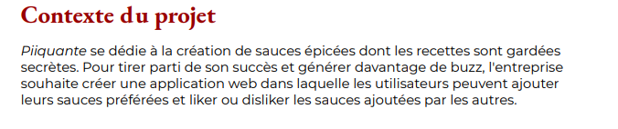

# Hot Takes / Back-end
Ce repository est réalisé dans le cadre d'une formation OpenClassRooms, il contient la version back du projet. 
La partie front est disponible à l'adresse suivante : https://github.com/OpenClassrooms-Student-Center/Web-Developer-P6

**Le projet :**    

Une application de sauces piquantes dans laquelle l'utilisateur va pouvoir créer un compte, se connecter, 
créer une sauce, la supprimer, la modifier, liker ou disliker les sauces présentes sur l'appli. 
API REST avec utilisation du CRUD

**Spécification projet :** 
   
< images >
< images >

**Installation du projet :** 

Cloner le repo front  --> utiliser les commandes suivantes dans un terminal de commande

`cd front`  `npm install`  `npm run start`

Cloner ce repo back 
créer un fichier .env à la racine du dossier back comme dans le fichier .env.example avec vos identifiant de connexion à MongoDB
--> utiliser les commandes suivantes dans un nouveau terminal de commande

`cd back`  `npm install`  `node --watch server.js`